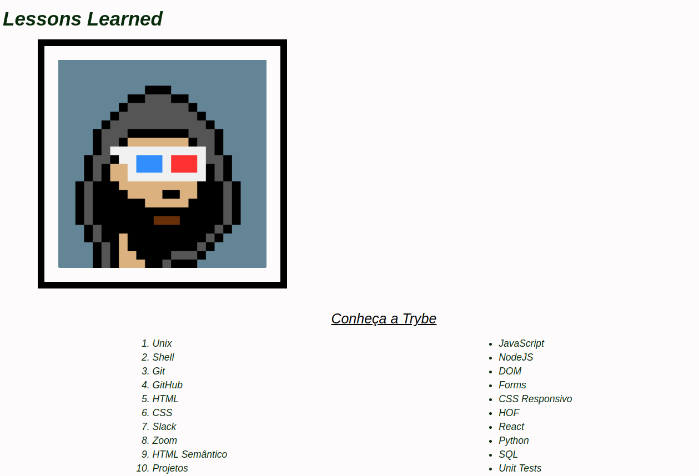
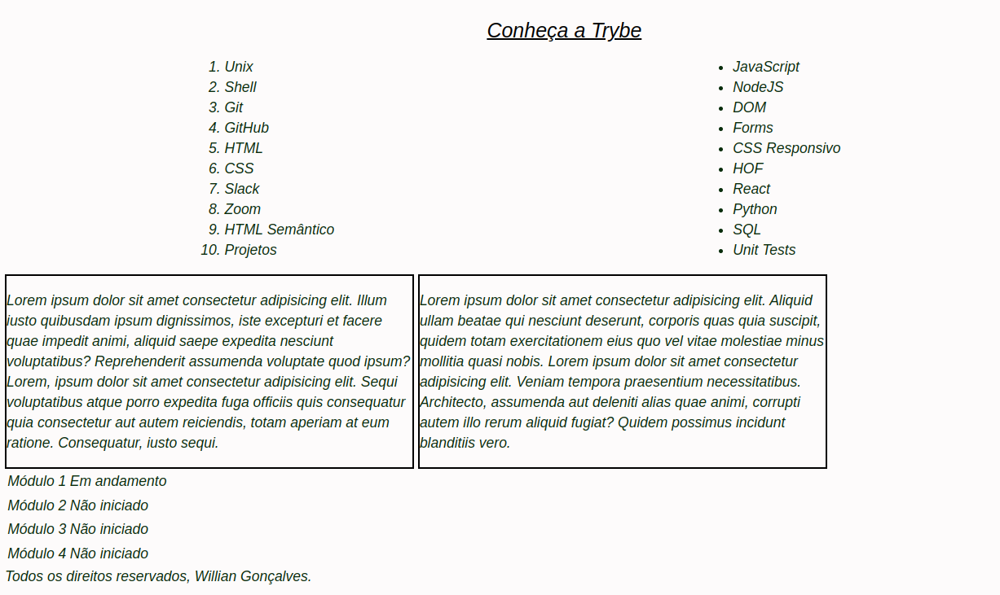

<h1><strong>Lessons Learned</strong></h1>

<h2><strong>Descrição</strong></h2>

  Este projeto consiste no desenvolvimento de um site que apresenta informações sobre o que aprendi na Trybe nas últimas duas seções. O objetivo principal é criar um site com elementos bem posicionados e estilizados utilizando HTML e CSS. Também foi dada ênfase ao uso correto de semântica para melhorar acessibilidade e ranqueamento em mecanismos de busca.

<h2><strong>Funcionalidades</strong></h2>
<ul>
  <li align="justify">
    Apresentação das informações aprendidas. O site reúne lições e conteúdos estudados na Trybe, exibindo de forma clara e organizada.
  </li>
  <li align="justify">
    Elementos posicionados e estilizados. Técnicas de CSS foram utilizadas para criar um layout agradável e responsivo.
  </li>
  <li align="justify">
    Uso adequado de semântica HTML. A estrutura foi construída com tags semânticas para melhorar acessibilidade e SEO.
  </li>
</ul>

<h2><strong>Demonstração do Projeto</strong></h2>

  
  
   
  <a href="https://williandpg.github.io/lessons-learned/" target="_blank"><strong>Visite o projeto</strong></a>

<h2 id="tech">Tecnologias Utilizadas</h2>
<ul>
  <li>
    <a href="https://developer.mozilla.org/pt-BR/docs/Web/HTML" target="_blank"><strong>HTML</strong></a>: Utilizado para estruturação e semântica do conteúdo.
  </li>
  <li>
    <a href="https://developer.mozilla.org/pt-BR/docs/Web/CSS" target="_blank"><strong>CSS</strong></a>: Utilizado para estilização, posicionamento e aparência do site.
  </li>
  <li>
    <a href="https://github.com/" target="_blank"><strong>Git e GitHub</strong></a>: Utilizados para versionamento e hospedagem do projeto.
  </li>
</ul>

<h2><strong>Estrutura do Projeto</strong></h2>
<pre><code>/
├── cypress/
├── img/
│   ├── lessons-learned.png
│   └── lessons-learned2.png
├── .editorconfig
├── .gitignore
├── .stylelintrc.json
├── cypress.json
├── exemplo.png
├── index.html
├── package-lock.json
├── package.json
├── reporter.json
├── style.css
└── README.md
</code></pre>

<h2><strong>Contato</strong></h2>

  <strong>Willian Gonçalves</strong> |
  <a href="https://www.linkedin.com/in/williandpg/" target="_blank"><strong>LinkedIn</strong></a> |
  <a href="https://github.com/williandpg" target="_blank"><strong>GitHub</strong></a> |
  <a href="https://williandpg.github.io/" target="_blank"><strong>Portfólio</strong></a> |
  <a href="mailto:goncalves.wdp@outlook.com" target="_blank"><strong>Email</strong></a>

<h2><strong>Créditos</strong></h2>

  Este projeto foi desenvolvido durante o curso de Desenvolvimento Web da Trybe, como atividade prática das seções de HTML e CSS.

  
<strong>English Version</strong>

  <h1><strong>Lessons Learned</strong></h1>

  <h2><strong>Description</strong></h2>
  

    This project consists of a website that presents what I learned in the last two sections of the Trybe course. The goal was to build a well-structured and visually organized page using HTML and CSS while applying proper semantic tags for accessibility and SEO.
  

  <h2><strong>Features</strong></h2>
  <ul>
    <li>Learning summary. The website compiles the main lessons studied at Trybe.</li>
    <li>Styled and positioned elements. CSS was used to create a clean and organized layout.</li>
    <li>Correct semantic usage. The project follows accessibility and SEO best practices.</li>
  </ul>

  <h2><strong>Project Demonstration</strong></h2>
  

    
    
     
    <a href="https://williandpg.github.io/lessons-learned/" target="_blank"><strong>Access the project</strong></a>
  

  <h2><strong>Technologies Used</strong></h2>
  <ul>
    <li>
      <a href="https://developer.mozilla.org/en-US/docs/Web/HTML" target="_blank"><strong>HTML</strong></a>: Structure and semantics.
    </li>
    <li>
      <a href="https://developer.mozilla.org/en-US/docs/Web/CSS" target="_blank"><strong>CSS</strong></a>: Styling and positioning.
    </li>
    <li>
      <a href="https://github.com/" target="_blank"><strong>Git & GitHub</strong></a>: Version control and hosting.
    </li>
  </ul>

  <h2><strong>Project Structure</strong></h2>
  <pre><code>/
  ├── cypress/
  ├── img/
  │   ├── lessons-learned.png
  │   └── lessons-learned2.png
  ├── .editorconfig
  ├── .gitignore
  ├── .stylelintrc.json
  ├── cypress.json
  ├── exemplo.png
  ├── index.html
  ├── package-lock.json
  ├── package.json
  ├── reporter.json
  ├── style.css
  └── README.md
  </code></pre>

  <h2><strong>Contact</strong></h2>
  

    <strong>Willian Gonçalves</strong> |
    <a href="https://www.linkedin.com/in/williandpg/" target="_blank">LinkedIn</a> |
    <a href="https://github.com/williandpg" target="_blank">GitHub</a> |
    <a href="https://williandpg.github.io/" target="_blank">Portfolio</a> |
    <a href="mailto:goncalves.wdp@outlook.com" target="_blank">Email</a>
  

  <h2><strong>Credits</strong></h2>
  

    Developed as part of Trybe’s Web Development course. This project served as a practical exercise for the HTML and CSS sections.
  

